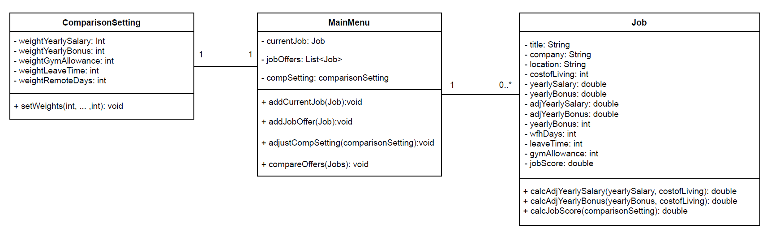
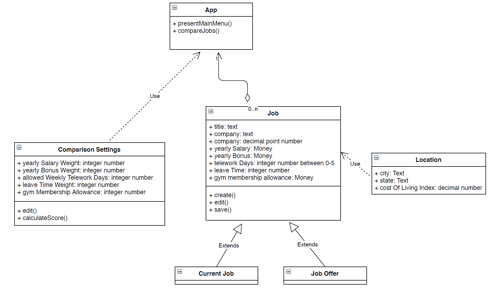
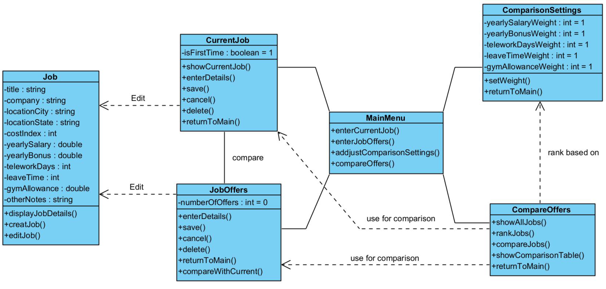
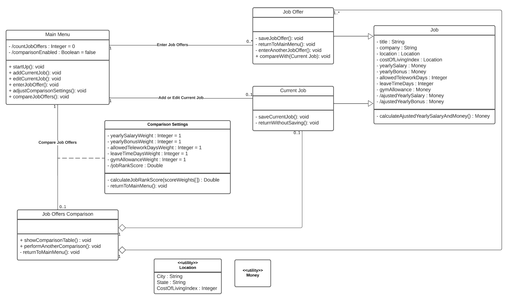

## Design Discussion

### 1. Individual Design Analysis
**Design 1 (czhou332)**

Overview

 1. *MainMenu*: controls the app flow.
 2. *ComparisonSeetings*: sets weights for each individual parameter.
 3. *Job*: all attributes for jobs. Includes the job score and yearly salary and bonus calculations.

Pros

 1. Simple, just three classes.
 2. Includes two functions to calculate adjusted bonus and salary.
 
Cons
 1. Missing relationship descriptions among classes.
 2. Missing direction of relationship between classes.
 3. Didn’t cover GUI actions, like *Save* and *Display*.
 4. One big class for job offers and current job -- Having separate classes for current job and job offers would make it easier for their operations, instead of bundling them in a larger class.
 
**Design 2 (jbeatty9)**

Overview

 1. *App*: main component.
 2. *Comparison Settings*: comparison metrics with weights.
 3. *Current Job* and *Job offer*: extends the main *Job* class.
 4. *Location*: abstraction for reusing across components.

Pros

 1. Having an *App* module to coordinate presentation and relationship among classes.
 2. Heritage usage between *Job* and its subclasses.
 3. Use of utility class *location*.
 
Cons
 1. Missing some actions like *addJob*.
 2. Missing calculation functions for calculations.
 3. *Job.Company* type is inaccurate (I.e. decimal point number)
 4. Missing relationship between classes.

**Design 3 (cji62)**

Overview

 1. *MainMenu*: contains main actions.
 2. Keep related actions within each relevant component, instead of adding them to *MainMenu*.
 
Pros

 1. Separate classes for current job and job offers with their own calculations.
 2. Clear relationship between classes.
 3. Makes use of initial weights set to 1 as default setting in *ComparisonSettings*.
 
Cons
 1. Missing the adjusted salary calculation.
 2. Some GUI actions may be duplicated or could be integrated somewhere else (e.g. *enter()* and *save()*)
 3. Missing multiplicity among classes.

**Design 4 (ewolf31)**

Overview

 1. *Main Menu*: contains main actions.
 2. *Current Job* and *Job Offer*: extends the main *Job* class.
 3. *Location* and *Money*: abstraction for reusing across components.

Pros

 1. Both *Current Job* and *Job Offer* are in heritage to *Job*.
 2. Utility class of *Money* and *Location*.
 3. *Comparison Settings* to have the weights as the relationship.
 4. Stated cardinality on relationship lines.
 
Cons
 1. More classes introduce complexity.
 2. Duplicated actions.
 3. Calculate operations might be redundant.
 
### 2. Team Design

Our team design is based on the design of Eric (ewolf31), which we consider a comprehensive one. The team design has 8 classes:

 - *Main Menu*: This class is included in all of the individual designs, and we agree that *Main Menu* is important as an entry point of the app.
 - *Job*, *Job Offer* and *Current Job*: Emma (czhou332) uses a single *Job* class for simplicity. After discussion, we think we need to have separate *Job Offer* and *Current Job*, as subclass of *Job*. *Job* includes the job details as attributes, while *Job Offer* and *Current Job* have their own respective operations and relationships with other classes.
 - *Comparison Settings* and *Job Offer Comparison*: Emma and John (jbeatty9) only include *Comparison Settings* and use related operations to fulfill job comparison requirements. Our team design includes *Job Offer Comparison* directly associating with *Main Menu*, and have *Comparison Settings* as an association class to better represent the relationship.
 - *Location* and *Money*: Eric and John have these utility classes in their design. We think these utility classes will make it easier to handle specific user inputs.

During our discussion, we make other modifications on our framework. 

We add calculation operations for attributes that are derived from user inputs. Including *calculateAdjustedYearlySalaryAndMoney()* in *Job* and *calculateJobRankScore()* in *Comparison Settings*.

We add operations and attributes to specify some requirements. Including *showComparisonTable()* in *Job Offers Comparison*, *returnToMain()* in *Comparison Settings* and *CostOfLivingIndex* in *Location*.

We don’t include some GUI actions presented by Chenguang (cji62) because these may duplicated or could be integrated somewhere else.

### 3. Summary

We think everyone knows his/her own design best, so we start our discussion by giving a short analysis of our own design, followed by comments from other team members. After every design is discussed, we decide to create our team design based on Eric’s design. Again, each team member compares his/her own design with Eric’s design, and provides feedback about what is good and what can be improved. This turns out to be an efficient and effective approach. The final design consists of good features from individual designs and covers all the requirements.

There are still some points that we haven’t reached agreements on: if certain attributes should be included in class A or class B; if certain operations are necessary; if something should be an attribute or an operation, etc. We think these trivial design decisions can be left until our implementation, partly because they are trivial and partly because we don’t know how they will be implemented because this is an implementation neutral design.

Besides the design itself, we also discuss our design description document. For requirement 6, we think it is important to mention that the detailed calculation, as an implementation instruction, should not be included in our design.

 
