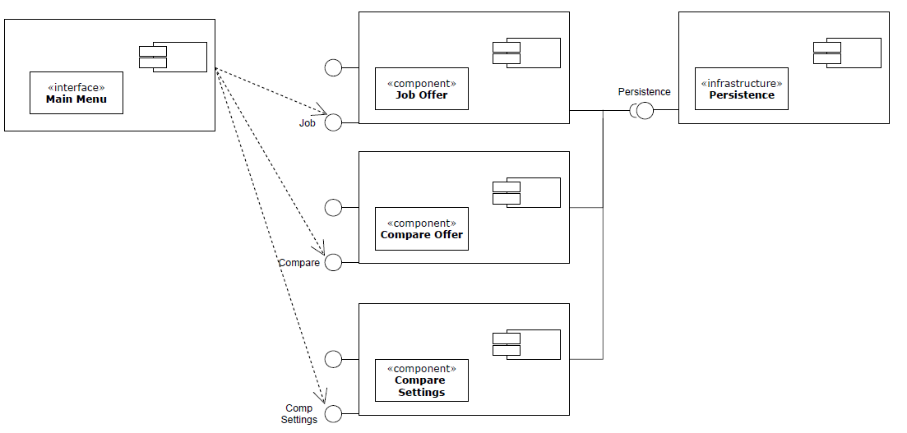
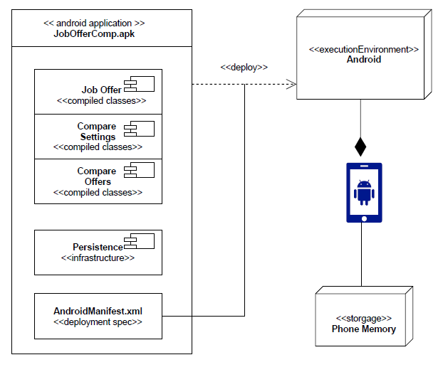
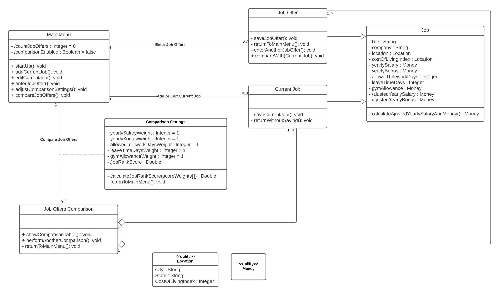
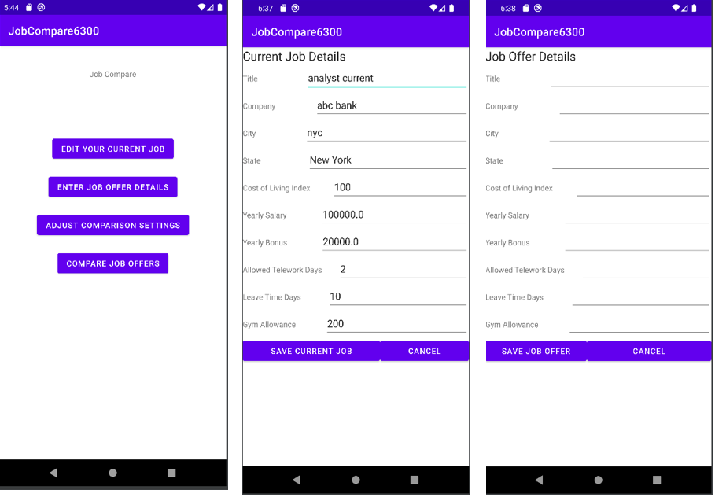
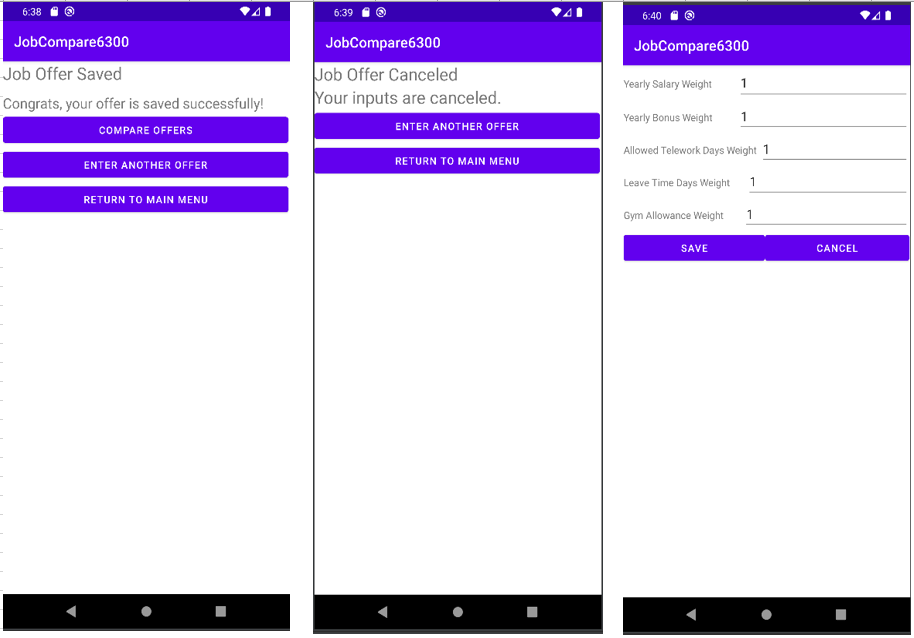
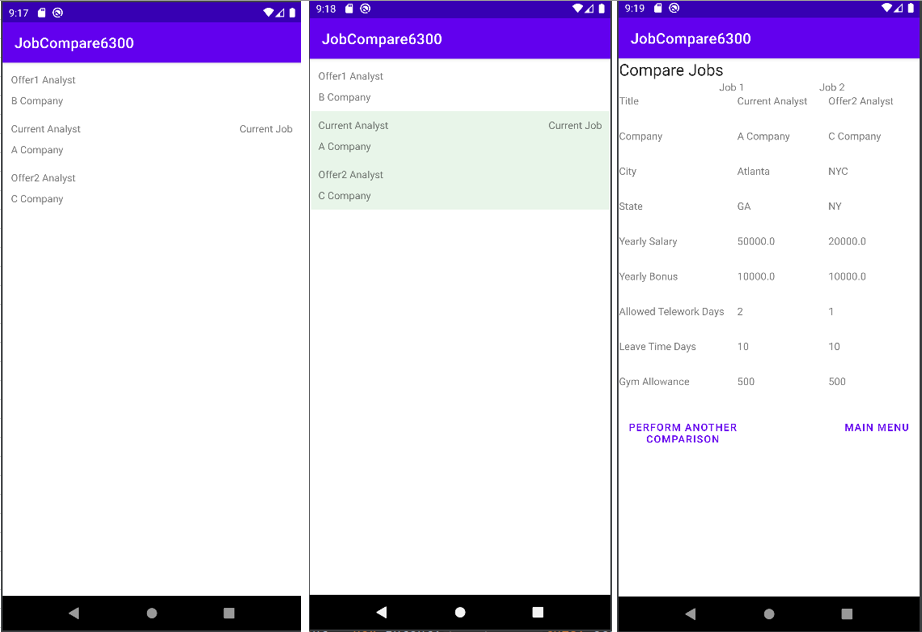

# Design Document

**Author**: Team 168, Fall 2021

**Version**: 3.1

**Last Update**: Oct 24th, 2021

## 1 Design Considerations

### 1.1 Assumptions

- The job offer comparison software is a single-user application operating on Android devices.
- There is no communication or saving between devices.
- This application aims to assit user to manage and compare current job and job offers.
- The programming language for this application is Java.
- The Android device should support SQLite in order to ensure data persistence between sessions.

### 1.2 Constraints

- The minimum API level for the app is “API 29: Android 10.0 (Q)”. 
- The development process is subject to the following timeline:
	- Phase 1 (Planning and Design): 9/27/2021 to 10/10/2021
	- Phase 2 (Construction): 10/11/2021 - 10/17/2021
	- Phase 3 (Testing and Delivery): 10/18/2021 - 10/24/2021

### 1.3 System Environment

- The application is only compatible with devices with operating system Android 10.0 or later.
- The application performs the best with resolution of 1440x3040 pixels on touchscreen.

## 2 Architectural Design

### 2.1 Component Diagram

*

- Main Menu:
	- Main Menu is the entry point of the Android App. 
	- It provides an GUI for user to select actions to perform.
	- This component is connected to major components, such as Job, Compare, and Comp Settings.

- Job:
	- The Job component stores all job/offer details as attributes that are input by user.
	- This component also include operations when users enter/edits jobs or offers.

- Comp Settings:
	- This component stores the weights to calculate job score.

- Compare:
	- The Compare component include operations to calculate job score, rank job/offers, and compare/display offers.

- Persistence:
	- This component ensure data persistence by leveraging SQLite.
	- This component is linked to other components to handle with data storage.

### 2.2 Deployment Diagram

*

- This application is a simple system without reliance on external server.
- The compiled classes, persistence, and manifest file for this application are packaged in a APK file.
- The APK file is deployable on Android phone

## 3 Low-Level Design

### 3.1 Class Diagram

*

### 3.2 Other Diagrams

*<u>Optional</u>* 

The team decided not to use any other diagrams here, as diagrams above have showed the design of system clearly.

## 4 User Interface Design
*For GUI-based systems, this section should provide the specific format/layout of the user interface of the system (e.g., in the form of graphical mockups).*

*

*

*

