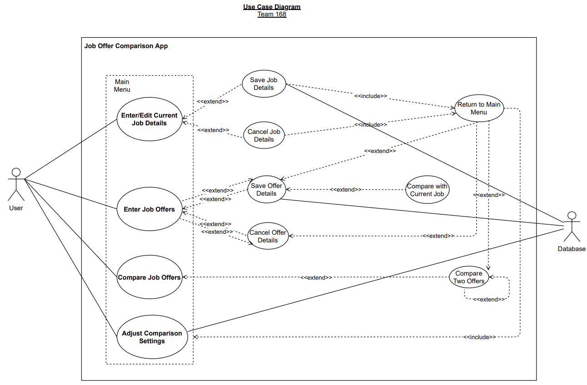

# Use Case Model

**Author**: Team 168, Fall 2021

**Version**: 3.1

**Last Update**: Oct 24th, 2021

## 1 Use Case Diagram

## 2 Use Case Descriptions

### Enter/Edit Current Job Details

- *Requirements:*
	- Allow user to enter current job details if current job does not exist, or allow user to edit current job details if current job exists.

- *Pre-conditions:*
	- User starts the App and selects Enter/Edit Current Job on Main Menu.

- *Post-conditions:*
	- Current job details are entered or edited by user's input. After that, user will choose to either save or cancel.

- *Scenarios:*
	- On Main Menu, user selects Enter/Edit Current Job.
	- On Enter/Edit Current Job screen, the user will see a list of job details waiting to be entered.
	- Depending on whether current job exists, the user can:
		- Edit current job details if current job exists.
		- Enter current job details if current job does not exist.
	- Prevent user from inputting invalid information.
	- After user edits/enters current job details, the user can:
		- Select save to keep current job details edited/entered.
		- Select cancel to clear the job details edited/entered.
	- After saving, the database will be udpated.

### Save Job Details

- *Requirements:*
	- Allow user to save current job details after enters/edits.

- *Pre-conditions:*
	- User selects Save after enters/edits current job details.

- *Post-conditions:*
	- Save the current job details entered or edited by user's input and return to Main Menu.

- *Scenarios:*
	- User selects Save after edits/enters current job details on Enter/Edit Current Job Details screen:
	- Depending on whether current job exists, the job details will be:
		- Updated if the current job exists.
		- Created if the current job does not exists.
	- After saving, the databse will be updated.
	- Return to Main Menu

### Cancel Job Details

- *Requirements:*
	- Allow user to cancel current job details after enters/edits.

- *Pre-conditions:*
	- User selects Cancel after enters/edits current job details.

- *Post-conditions:*
	- Cancel the current job details entered or edited by user's input and return to Main Menu

- *Scenarios:*
	- User selects Cancel after edits/enters current job details on Enter/Edit Current Job Details screen:
	- The job details will not be saved.
	- Return to Main Menu

### Enter Job Offer

- *Requirements:*
	- Allow user to enter offer details.

- *Pre-conditions:*
	- User starts the App and selects Enter Job Offer on Main Menu.

- *Post-conditions:*
	- Current job details are entered or edited by user's input. After that, user will choose to either save or cancel.

- *Scenarios:*
	- On Main Menu, user selects Enter Job Offer.
	- On Enter Job Offer screen, the user will see a list of offer details.
	- The user can enter offer details.
	- Prevent user from inputting invalid information.
	- After user enters offer details, the user can:
		- Select save to keep offer details entered.
		- Select cancel to get rid of the offer details entered.
	- After saving, the databse will be updated.

### Save Offer Details

- *Requirements:*
	- Allow user to save offer details after enters.

- *Pre-conditions:*
	- User selects Save after enters offer details.

- *Post-conditions:*
	- Save the offer details entered by user's input. After that, the user can choose to:
		- Enter another offer
		- Return to Main Menu
		- Compare the offer with current job

- *Scenarios:*
	- User selects Save after enters offer details on Enter Job Offer screen.
	- The offer details will be created and saved.
	- After saving, the database will be updated.
	- Depending on whether current job exists, the user can further choose to:
		- Compare the offer with current job if current job exists.
		- Enter another offer, regardless of current job status.
		- Return to Main Menu, regardless of current job status.

### Cancel Offer Details

- *Requirements:*
	- Allow user to cancel offer details without save after enters.

- *Pre-conditions:*
	- User selects Cancel after enters offer details.

- *Post-conditions:*
	- Cancel the offer details entered by user's input. After that, the user can choose to:
		- Enter another offer
		- Return to Main Menu

- *Scenarios:*
	- User selects Cancel after enters offer details on Enter Job Offer screen.
	- The offer details will be canceled.
	- The user can further choose to:
		- Enter another offer.
		- Return to Main Menu.

### Compare with Current Job
- *Requirements:*
	- Allow user to compare the job offer just entered and saved with current job.

- *Pre-conditions:*
	- User save job offer details after enters and then selects Compare with Current Job.

- *Post-conditions:*
	- Current job details will show up together with offer details for comparison purpose, displayed side-by-side.

- *Scenarios:*
	- The user enters offer details and selects Save.
	- If current job exists, the user can compare the offer entered and saved with current job.
		- Both current job details and job offer details are displayed side-by-side.
	- If current job does not exist, the comparison is disabled.

### Compare Job Offers

- *Requirements:*
	- Allow user to compare job offers.

- *Pre-conditions:*
	- User starts the App and selects Compare Job Offers on Main Menu.

- *Post-conditions:*
	- Take user to the Rank All Offers screen, where all offers and current job (if exists), displayed as title and company, are ranked in a list from the best to the worst. After that, user can choose any two from the list to further compare job details.

- *Scenarios:*
	- On Main Menu, user selects Compare Job Offers.
	- If there are less than two job/offers, this compare is disabled.
	- If there are two or more job/offers, take user to Rank All Offers screen.
	- On Rank All Offers screen, depending on whether current job exist, the user will see:
		- All offers, displayed as title and company, ranked from the best to the worst if current job does not exist.
		- All offers together with current job, displayed as title and company, ranked from the best to the worst if current job exists.
	- The user can then choose any two from the offers/jobs list for further comparison.

### Compare Two Offers

- *Requirements:*
	- Allow user to select any two offers/jobs from the ranking and see a comparison on job details.

- *Pre-conditions:*
	- User selects any two offers/jobs from the ranking.

- *Post-conditions:*
	- Take user to the Compare Two Offers screen, where both offers/jobs selected are displayed in details, side-by-side. After that, user can choose to:
		- Do another comparison
		- Return to Main Menu 

- *Scenarios:*
	- On Rank All Offers screen, user can choose any two from the offers/jobs list for further comparison.
	- A new screen shows up, user can see offers/jobs selected displayed in details, side-by-side.
	- User can then choose to:
		- Do another comparison
		- Return to Main Menu

### Adjust Comparison Settings

- *Requirements:*
	- Allow user to adjust weights in comparison settings.

- *Pre-conditions:*
	- User starts the App and selects Adjust Comparison Settings on Main Menu.

- *Post-conditions:*
	- Take user to the Comparison Settings screen, where all weights can be adjusted by user. After adjust, new weights will be effective for job/offer ranking.

- *Scenarios:*
	- On Main Menu, user selects Adjust Comparison Settings.
	- On Comparison Settings screen, user will see current weights.
		- If user has never customized weights, all weights are set equally.
		- If user has customized weights, all weights are set by preference.
	- User can adjust the weights by preference.
	- All weights should be valid, eg. positive integer values.
	- Prevent user from typing invalid inputs.
	- After adjustments, new weights will be effective for job/offer ranking purpose.
	- After saving, the database will be updated.

### Return to Main Menu

- *Requirements:*
	- Allow user to return to main menu.

- *Pre-conditions:*
	- User selects Return to Main Menu on screen.

- *Post-conditions:*
	- Take user back to Main Menu 

- *Scenarios:*
	- User selects Return to Main Menu on any screens with this option.
	- Return to Main Menu.
