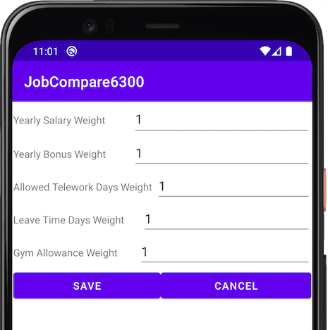

# Manual for JobCompare6300

## About this app
This very useful application allows job seekers to keep track and compare multiple job offers and their benefits.

| Feature                    | Description                                                                   |
|----------------------------|-------------------------------------------------------------------------------|
| Add your current Job       | Allows to input information related to your current job                       |
| Enter Job Offer details    | Gather information from multiple offers to enabled comparison                 |
| Adjust comparison settings | Used to fine tune the comparison algorithm to adjust its calculation          |
| Compare Job Offers         | Calculates the score for each Job and provides an ordered list for comparison |

## Required input

### Information required for the current job and job offers

| Field                        | Description                                            | Requirements                                   |
| ---------------------------- | ------------------------------------------------------ | ---------------------------------------------- |
| Title                        | Job title description                                  | Must contain at least one letter, e.g. A to z. |
| Company                      | Name of the company                                    | Must contain at least one letter, e.g. A to z. |
| City                         | City where the job is located                          | Must contain at least one letter, e.g. A to z. |
| State                        | State where the job is located                         | Must contain at least one letter, e.g. A to z. |
| Cost of living index         | Cost of Living index of the location of the job        | Must be a number greater than 0.               |
| Yearly salary                | Salary compensation of the job                         | Must be a number greater than 0.               |
| Yearly bonus                 | Bonus amount for the role, if any                      | Must be a number equal or greater than 0.      |
| Allowed weekly telework days | Number of days allowed to work remotely                | Must be a number equal or greater than 0.      |
| Leave time                   | Number of days allowed to take time off                | Must be a number equal or greater than 0.      |
| Gym membership allowance     | Monthly benefit amount to cover gym membership, if any | Must be a number equal or greater than 0.      |

> Note: the information needed for Current Job and Job Offers are the same.

> Note: Cost of Living index sourced from [&copy; 2009-2021 Expatistan](https://www.expatistan.com/cost-of-living/index/north-america).

### Job Offer confirmation

Once a Job Offer is added, the following options are presented:

| Feature             | Description                                 |
|---------------------|---------------------------------------------|
| Compare Offers      | Navigates to the Job Comparison page        |
| Enter Another Offer | Shows the form to include another Job Offer |
| Return to Main menu | Returns to the Main menu                    |

### Comparison settings

You can assign different weights to the following job attributes and prioritize job offers that better match your personal goals.

| Weight Fields                | Default weight |
| ---------------------------- | -------------- |
| Yearly salary                | 1              |
| Yearly bonus                 | 1              |
| Allowed weekly telework days | 1              |
| Leave time                   | 1              |
| Gym membership allowance     | 1              |

## How the comparison works

Once all required information is provided for the current job and at least one job offer. The comparison is calculated using the following formula:

| Legend | Description                  |
| ------ | ---------------------------- |
| AYS    | Annual Yearly salary         |
| AYB    | Annual Yearly bonus          |
| GYM    | Gym membership allowance     |
| LT     | Leave time                   |
| RWT    | Allowed weekly telework days |

### Comparison results

The algorithm will calculate the score for the Current Job and for all Job Offers and present them ordered in a list for easy comparison.

Additionally, choosing two separate Jobs allows comparison of all details between each offer.

# About JobCompare6300

## System requirements

A mobile device running Android 10.0 (Q) or newer.

## Data privacy

This app doesn't collect or require any personal data or sensitive device permissions to run.

## Credits

> &copy; 2021 6300Fall21Team168, Inc.

| Team member   | Role                   |
| ------------- | ---------------------- |
| Beatty, John  | Lead Developer         |
| Ji, Chenguang | Lead Quality Assurance |
| Wolf, Eric    | Project manager        |
| Zhou, Chi     | Lead Designer          |

## Feedback

For questions on how to use the app reach out to 6300Fall21Team168@noreply.gatech.edu.

## License

Licensed under the [GNU GPLv3](https://spdx.org/licenses/GPL-3.0-or-later.html) license.

## Metadata

**Author**: Team 168, Fall 2021

**Version**: 4.6

**Last Update**: Oct 24th, 2021
